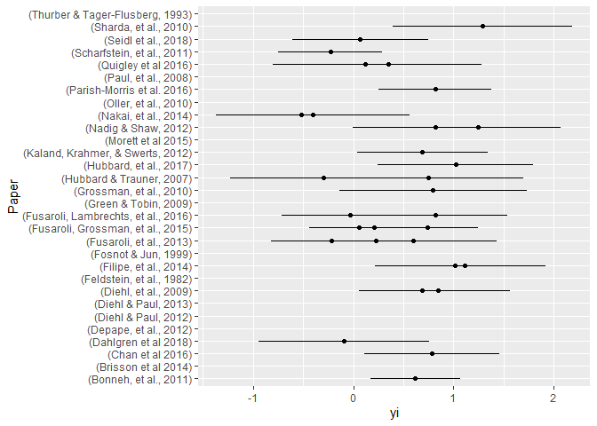
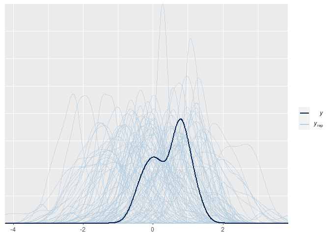
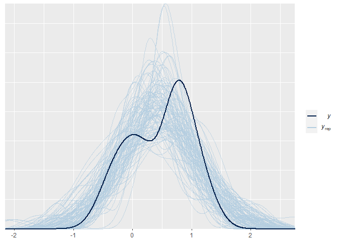

Assignment 4
------------

In this assignment we do the following: - we run a Bayesian
meta-analysis of pitch variability in ASD, based on previously published
literature - we analyze pitch variability in ASD in two new studies
using both a conservative and a meta-analytic prior - we assess the
difference in model quality and estimates using the two priors.

The questions you need to answer are: What are the consequences of using
a meta-analytic prior? Evaluate the models with conservative and
meta-analytic priors. Discuss the effects on estimates. Discuss the
effects on model quality. Discuss the role that meta-analytic priors
should have in scientific practice. Should we systematically use them?
Do they have drawbacks? Should we use them to complement more
conservative approaches? How does the use of meta-analytic priors you
suggest reflect the skeptical and cumulative nature of science?

### Step by step suggestions

Step 1: Perform a meta-analysis of pitch variability from previous
studies of voice in ASD - the data is available as
Ass4\_MetaAnalysisData.tsv - You should calculate Effect size (cohen’s
d) and Standard Error (uncertainty in the Cohen’s d) per each study,
using escalc() from the metafor package (also check the livecoding
intro) - N.B. we’re only interested in getting a meta-analytic effect
size for the meta-analytic prior (and not e.g. all the stuff on
publication bias). See a brms tutorial here:
<a href="https://vuorre.netlify.com/post/2016/09/29/meta-analysis-is-a-special-case-of-bayesian-multilevel-modeling/" class="uri">https://vuorre.netlify.com/post/2016/09/29/meta-analysis-is-a-special-case-of-bayesian-multilevel-modeling/</a>
The formula is EffectSize \| se(StandardError) \~ 1 + (1 \| Paper).
Don’t forget prior definition, model checking, etc.

``` r
# We set a seed
set.seed(3)
# Read the data
m <- read_tsv("Ass4_MetaAnalysisData.tsv")
```

    ## Parsed with column specification:
    ## cols(
    ##   .default = col_double(),
    ##   Paper = col_character(),
    ##   Author = col_character(),
    ##   Population = col_character(),
    ##   DiagnosisDetails = col_character(),
    ##   Language = col_character(),
    ##   Language2 = col_character(),
    ##   Task = col_character(),
    ##   Task2 = col_character(),
    ##   PitchMean_Units = col_character(),
    ##   PitchMeanASDvsTD = col_character(),
    ##   PitchRange_Units = col_character(),
    ##   PitchRangeASDvsTD = col_character(),
    ##   PitchSD_Units = col_character(),
    ##   PitchSDASDvsTD = col_character(),
    ##   PitchVariability_Units = col_character(),
    ##   PitchVariabilityASDvsTD = col_character(),
    ##   IntensityMean_Units = col_character(),
    ##   IntensityMeanASDvsTD = col_character(),
    ##   UtteranceDurationUnit = col_character(),
    ##   UtteranceDurationASDvsTD = col_character()
    ##   # ... with 5 more columns
    ## )

    ## See spec(...) for full column specifications.

``` r
# We subset NAs
m <- m %>% subset(!is.na(Paper))

# We will calculate Effect sizes
PitchMeanES <- escalc('SMD',
  n1i = ASD_N, n2i = TD_N, 
  m1i = PitchVariabilityASD_Mean, m2i = PitchVariabilityTD_Mean,                     
  sd1i = PitchVariabilityASD_SD, sd2i = PitchVariabilityTD_SD,  
  data = m, 
  slab = Paper)

# We calculate the stanard error
PitchMeanES <- PitchMeanES %>% mutate(
  sei = sqrt(PitchMeanES$vi)
  )

#vi is a measure of uncertainty (sd^2) variance
#yi is the mean estimated cohen's d wihtin study = effect size

# We plot the studies
library(ggplot2)
ggplot(PitchMeanES, aes(x=yi, y=Paper)) +
  geom_segment(aes(x = yi-sei*2, xend = yi+sei*2, y=Paper, yend=Paper)) +
  geom_point()
```

    ## Warning: Removed 11 rows containing missing values (geom_segment).

    ## Warning: Removed 11 rows containing missing values (geom_point).



``` r
# We define the formula
MA_f <- bf(
  yi | se(sei) ~ 1 + (1 | Population) # We say the outcome measure should not be taken at face value but we expect it to vary
)
get_prior(MA_f, family = gaussian, data = PitchMeanES)
```

    ## Warning: Rows containing NAs were excluded from the model.

    ##                 prior     class      coef      group resp dpar nlpar bound
    ## 1 student_t(3, 1, 10) Intercept                                           
    ## 2 student_t(3, 0, 10)        sd                                           
    ## 3                            sd           Population                      
    ## 4                            sd Intercept Population

``` r
MA_prior <- c(
  prior(normal(0, 1), class = Intercept), # # what is my prior for the meta-analytical effect size - being sceptical putting the mean to zero
  prior(normal(0, .3), class = sd) # variabiity is likely to be up to .6 but we expect it around .3
)

Prior_check <- brm(
  formula = MA_f, 
  prior = MA_prior,
  family = gaussian(),
  data = PitchMeanES, 
  sample_prior = "only", 
  chains = 2, 
  core = 2,
  file = "Prior_check"
)
summary(Prior_check)
```

    ##  Family: gaussian 
    ##   Links: mu = identity; sigma = identity 
    ## Formula: yi | se(sei) ~ 1 + (1 | Population) 
    ##    Data: PitchMeanES (Number of observations: 30) 
    ## Samples: 2 chains, each with iter = 2000; warmup = 1000; thin = 1;
    ##          total post-warmup samples = 2000
    ## 
    ## Group-Level Effects: 
    ## ~Population (Number of levels: 26) 
    ##               Estimate Est.Error l-95% CI u-95% CI Rhat Bulk_ESS Tail_ESS
    ## sd(Intercept)     0.24      0.18     0.01     0.67 1.00     1405      686
    ## 
    ## Population-Level Effects: 
    ##           Estimate Est.Error l-95% CI u-95% CI Rhat Bulk_ESS Tail_ESS
    ## Intercept    -0.01      0.99    -1.97     1.92 1.00     3326     1513
    ## 
    ## Samples were drawn using sampling(NUTS). For each parameter, Bulk_ESS
    ## and Tail_ESS are effective sample size measures, and Rhat is the potential
    ## scale reduction factor on split chains (at convergence, Rhat = 1).

``` r
#Prior predictive check
pp_check(Prior_check, nsamples = 100)
```



``` r
MA_m1 <- brm(
  formula = MA_f, 
  prior = MA_prior,
  family = gaussian(),
  data = PitchMeanES, 
  sample_prior = T, 
  chains = 2, 
  core = 2,
  file = "MA_m1"
)
#Posterior predictive check
pp_check(MA_m1, nsamples = 100)
```



``` r
summary(MA_m1)
```

    ##  Family: gaussian 
    ##   Links: mu = identity; sigma = identity 
    ## Formula: yi | se(sei) ~ 1 + (1 | Population) 
    ##    Data: PitchMeanES (Number of observations: 30) 
    ## Samples: 2 chains, each with iter = 2000; warmup = 1000; thin = 1;
    ##          total post-warmup samples = 2000
    ## 
    ## Group-Level Effects: 
    ## ~Population (Number of levels: 26) 
    ##               Estimate Est.Error l-95% CI u-95% CI Rhat Bulk_ESS Tail_ESS
    ## sd(Intercept)     0.32      0.10     0.13     0.52 1.00      845      918
    ## 
    ## Population-Level Effects: 
    ##           Estimate Est.Error l-95% CI u-95% CI Rhat Bulk_ESS Tail_ESS
    ## Intercept     0.44      0.09     0.27     0.63 1.00     1487     1321
    ## 
    ## Samples were drawn using sampling(NUTS). For each parameter, Bulk_ESS
    ## and Tail_ESS are effective sample size measures, and Rhat is the potential
    ## scale reduction factor on split chains (at convergence, Rhat = 1).

``` r
# MetaAnalysis effect mean = 0.44, sd = 0.01

MA_mean <- fixef(MA_m1)[[1]]

MA_se <- fixef(MA_m1)[[2]]

MA_hetero <- 0.32
```

-   Write down the results of the meta-analysis in terms of a prior for
    step 2.

Step 2: Analyse pitch variability in ASD in two new studies for which
you have access to all the trials (not just study level estimates) - the
data is available as Ass4\_data.csv. Notice there are 2 studies
(language us, and language dk), multiple trials per participant, and a
few different ways to measure pitch variability (if in doubt, focus on
pitch IQR, interquartile range of the log of fundamental frequency) -
Also, let’s standardize the data, so that they are compatible with our
meta-analytic prior (Cohen’s d is measured in SDs). - Is there any
structure in the dataset that we should account for with random/varying
effects? How would you implement that? Or, if you don’t know how to do
bayesian random/varying effects or don’t want to bother, is there
anything we would need to simplify in the dataset?

``` r
# We get the data
d <- read_csv("Ass4_data.csv", col_types = cols(ID=col_character()))

# We scale the variable we will need
d <- d %>% mutate(
  PitchVariability = scale(Pitch_IQR)
)

# Language = fixed effect
# ID --> varying effect
```

Step 3: Build a regression model predicting Pitch variability from
Diagnosis. - how is the outcome distributed? (likelihood function). NB.
given we are standardizing, and the meta-analysis is on that scale,
gaussian is not a bad assumption. Lognormal would require us to convert
the prior to that scale. We expect it to be Gaussian. - how are the
parameters of the likelihood distribution distributed? Which predictors
should they be conditioned on? Start simple, with Diagnosis only. Add
other predictors only if you have the time and energy! - use a
skeptical/conservative prior for the effects of diagnosis. Remember
you’ll need to motivate it. - Evaluate model quality. Describe and plot
the estimates.

``` r
# We look at the distribution of the Pitch Variability data
hist(d$PitchVariability)
```


``` r
# It looks close to a gaussian distribution
# We wil start making a model with diagnosis
pv_f1 <- bf(PitchVariability ~ 1 + Diagnosis + (1|ID))
pv_f2 <- bf(PitchVariability ~ 0 + Language + Language:Diagnosis + (1|ID)) # The : better reflects what we know about the expected difference for diagnosis

# We look at default priors
get_prior(pv_f1, family = gaussian, d)
```

    ##                 prior     class        coef group resp dpar nlpar bound
    ## 1                             b                                        
    ## 2                             b DiagnosisTD                            
    ## 3 student_t(3, 0, 10) Intercept                                        
    ## 4 student_t(3, 0, 10)        sd                                        
    ## 5                            sd                ID                      
    ## 6                            sd   Intercept    ID                      
    ## 7 student_t(3, 0, 10)     sigma

``` r
# sd prior is the random variation
# sigma is the errror we whould expect the model makes

# We look at ASD as these are the intercept
ASD <- d%>% filter(Diagnosis == "ASD")
summary(ASD$PitchVariability)
```

    ##        V1          
    ##  Min.   :-1.85234  
    ##  1st Qu.:-0.51538  
    ##  Median : 0.03606  
    ##  Mean   : 0.13883  
    ##  3rd Qu.: 0.70611  
    ##  Max.   : 4.54106

``` r
TD <- d%>% filter(Diagnosis == "TD")
summary(TD$PitchVariability)
```

    ##        V1         
    ##  Min.   :-1.8216  
    ##  1st Qu.:-0.8661  
    ##  Median :-0.3433  
    ##  Mean   :-0.1270  
    ##  3rd Qu.: 0.4421  
    ##  Max.   : 3.9254

``` r
# We make our own priors
prior_pv <- c(
  prior(normal(0, .1), class = Intercept), 
  # What should we expect as the average pitch variability for the ASDs. We expect a 0 difference. 
  prior(normal(0, .1), class = b), 
  # The effect is probably small in these studies
  prior(normal(0, .1), class = sd), 
  # shrink them towards the mean
  prior(normal(.5, .3), class = sigma) ) 
# We make a sceptical sigma with an error up to 5. 
#RF: Check sd(pitchvariability) = 1 and then makes (.1, .3) 


prior_pv_PriorCheck <- brm(
  formula = pv_f1,
  data = d,
  family = gaussian,
  prior = prior_pv,
  sample_prior = "only", #Only looks at priors
  file = "prior_pv_check"
)

#dev.off() #This function worked when I got a pallette bug
#Prior predictive check
pp_check(prior_pv_PriorCheck, nsamples = 100) # Are the generated values in the right magnitude?
```


``` r
## Fitting the model
pv_m <- brm(
  formula = pv_f1,
  data = d,
  family = gaussian,
  prior = prior_pv,
  sample_prior = T, 
  file = "pv_m"
)

pp_check(pv_m, nsamples = 100)
```


``` r
summary(pv_m)
```

    ##  Family: gaussian 
    ##   Links: mu = identity; sigma = identity 
    ## Formula: PitchVariability ~ 1 + Diagnosis + (1 | ID) 
    ##    Data: d (Number of observations: 1074) 
    ## Samples: 4 chains, each with iter = 2000; warmup = 1000; thin = 1;
    ##          total post-warmup samples = 4000
    ## 
    ## Group-Level Effects: 
    ## ~ID (Number of levels: 149) 
    ##               Estimate Est.Error l-95% CI u-95% CI Rhat Bulk_ESS Tail_ESS
    ## sd(Intercept)     0.64      0.04     0.57     0.72 1.00     1658     2525
    ## 
    ## Population-Level Effects: 
    ##             Estimate Est.Error l-95% CI u-95% CI Rhat Bulk_ESS Tail_ESS
    ## Intercept       0.21      0.06     0.09     0.34 1.00     1390     2332
    ## DiagnosisTD    -0.08      0.08    -0.24     0.07 1.00     2075     2563
    ## 
    ## Family Specific Parameters: 
    ##       Estimate Est.Error l-95% CI u-95% CI Rhat Bulk_ESS Tail_ESS
    ## sigma     0.71      0.02     0.67     0.74 1.00     5129     2874
    ## 
    ## Samples were drawn using sampling(NUTS). For each parameter, Bulk_ESS
    ## and Tail_ESS are effective sample size measures, and Rhat is the potential
    ## scale reduction factor on split chains (at convergence, Rhat = 1).

``` r
# Then it all again with the interaction of language

# We look at default priors
get_prior(pv_f2, family = gaussian, d)
```

    ##                 prior class                   coef group resp dpar nlpar bound
    ## 1                         b                                                   
    ## 2                         b             Languagedk                            
    ## 3                         b Languagedk:DiagnosisTD                            
    ## 4                         b             Languageus                            
    ## 5                         b Languageus:DiagnosisTD                            
    ## 6 student_t(3, 0, 10)    sd                                                   
    ## 7                        sd                           ID                      
    ## 8                        sd              Intercept    ID                      
    ## 9 student_t(3, 0, 10) sigma

``` r
# We define priors
NS_prior1 <- c(
  prior(normal(0, .3), class = b, coef = "Languagedk"),
  prior(normal(0, .3), class = b, coef = "Languageus"),
  prior(normal(0, .1), class = b, coef = "Languagedk:DiagnosisTD"),
  prior(normal(0, .1), class = b, coef = "Languageus:DiagnosisTD"),
  prior(normal(0, .1), class = sd),
  prior(normal(.5, .1), class = sigma)
)

# Fit prior model
pv_m2_prior <- brm(
  formula = pv_f2,
  data = d,
  family = gaussian,
  prior = NS_prior1,
  sample_prior = "only", 
  file = "pv_m2_prior"
)

#Prior predictive check
pp_check(pv_m2_prior, nsamples = 100) # Are the generated values in the right magnitude?
```


``` r
## Fitting the model
pv_m2 <- brm(
  formula = pv_f2,
  data = d,
  family = gaussian,
  prior = NS_prior1,
  sample_prior = T, 
  file = "pv_m2"
)
pp_check(pv_m2, nsamples = 100)
```


``` r
# For the first model
summary(pv_m)
```

    ##  Family: gaussian 
    ##   Links: mu = identity; sigma = identity 
    ## Formula: PitchVariability ~ 1 + Diagnosis + (1 | ID) 
    ##    Data: d (Number of observations: 1074) 
    ## Samples: 4 chains, each with iter = 2000; warmup = 1000; thin = 1;
    ##          total post-warmup samples = 4000
    ## 
    ## Group-Level Effects: 
    ## ~ID (Number of levels: 149) 
    ##               Estimate Est.Error l-95% CI u-95% CI Rhat Bulk_ESS Tail_ESS
    ## sd(Intercept)     0.64      0.04     0.57     0.72 1.00     1658     2525
    ## 
    ## Population-Level Effects: 
    ##             Estimate Est.Error l-95% CI u-95% CI Rhat Bulk_ESS Tail_ESS
    ## Intercept       0.21      0.06     0.09     0.34 1.00     1390     2332
    ## DiagnosisTD    -0.08      0.08    -0.24     0.07 1.00     2075     2563
    ## 
    ## Family Specific Parameters: 
    ##       Estimate Est.Error l-95% CI u-95% CI Rhat Bulk_ESS Tail_ESS
    ## sigma     0.71      0.02     0.67     0.74 1.00     5129     2874
    ## 
    ## Samples were drawn using sampling(NUTS). For each parameter, Bulk_ESS
    ## and Tail_ESS are effective sample size measures, and Rhat is the potential
    ## scale reduction factor on split chains (at convergence, Rhat = 1).

``` r
plot(hypothesis(pv_m, "DiagnosisTD < 0"))
```


``` r
hypothesis(pv_m, "DiagnosisTD < 0")
```

    ## Hypothesis Tests for class b:
    ##          Hypothesis Estimate Est.Error CI.Lower CI.Upper Evid.Ratio Post.Prob
    ## 1 (DiagnosisTD) < 0    -0.08      0.08    -0.22     0.04       6.07      0.86
    ##   Star
    ## 1     
    ## ---
    ## 'CI': 90%-CI for one-sided and 95%-CI for two-sided hypotheses.
    ## '*': For one-sided hypotheses, the posterior probability exceeds 95%;
    ## for two-sided hypotheses, the value tested against lies outside the 95%-CI.
    ## Posterior probabilities of point hypotheses assume equal prior probabilities.

``` r
## For the second model
summary(pv_m2)
```

    ##  Family: gaussian 
    ##   Links: mu = identity; sigma = identity 
    ## Formula: PitchVariability ~ 0 + Language + Language:Diagnosis + (1 | ID) 
    ##    Data: d (Number of observations: 1074) 
    ## Samples: 4 chains, each with iter = 2000; warmup = 1000; thin = 1;
    ##          total post-warmup samples = 4000
    ## 
    ## Group-Level Effects: 
    ## ~ID (Number of levels: 149) 
    ##               Estimate Est.Error l-95% CI u-95% CI Rhat Bulk_ESS Tail_ESS
    ## sd(Intercept)     0.51      0.03     0.44     0.57 1.00     1503     2375
    ## 
    ## Population-Level Effects: 
    ##                        Estimate Est.Error l-95% CI u-95% CI Rhat Bulk_ESS
    ## Languagedk                -0.22      0.08    -0.37    -0.07 1.01      981
    ## Languageus                 0.64      0.08     0.49     0.79 1.00     1725
    ## Languagedk:DiagnosisTD    -0.10      0.08    -0.25     0.06 1.00     1649
    ## Languageus:DiagnosisTD     0.07      0.08    -0.09     0.24 1.00     3048
    ##                        Tail_ESS
    ## Languagedk                 1906
    ## Languageus                 1934
    ## Languagedk:DiagnosisTD     2362
    ## Languageus:DiagnosisTD     3143
    ## 
    ## Family Specific Parameters: 
    ##       Estimate Est.Error l-95% CI u-95% CI Rhat Bulk_ESS Tail_ESS
    ## sigma     0.70      0.02     0.67     0.73 1.00     4133     3022
    ## 
    ## Samples were drawn using sampling(NUTS). For each parameter, Bulk_ESS
    ## and Tail_ESS are effective sample size measures, and Rhat is the potential
    ## scale reduction factor on split chains (at convergence, Rhat = 1).

``` r
plot(hypothesis(pv_m2, "Languagedk:DiagnosisTD < 0"))
```


``` r
plot(hypothesis(pv_m2, "Languageus:DiagnosisTD < 0"))
```


``` r
hypothesis(pv_m2, "Languagedk:DiagnosisTD < 0")
```

    ## Hypothesis Tests for class b:
    ##                 Hypothesis Estimate Est.Error CI.Lower CI.Upper Evid.Ratio
    ## 1 (Languagedk:Diagn... < 0     -0.1      0.08    -0.23     0.04       8.52
    ##   Post.Prob Star
    ## 1       0.9     
    ## ---
    ## 'CI': 90%-CI for one-sided and 95%-CI for two-sided hypotheses.
    ## '*': For one-sided hypotheses, the posterior probability exceeds 95%;
    ## for two-sided hypotheses, the value tested against lies outside the 95%-CI.
    ## Posterior probabilities of point hypotheses assume equal prior probabilities.

``` r
hypothesis(pv_m2, "Languageus:DiagnosisTD < 0")
```

    ## Hypothesis Tests for class b:
    ##                 Hypothesis Estimate Est.Error CI.Lower CI.Upper Evid.Ratio
    ## 1 (Languageus:Diagn... < 0     0.07      0.08    -0.07     0.21       0.23
    ##   Post.Prob Star
    ## 1      0.18     
    ## ---
    ## 'CI': 90%-CI for one-sided and 95%-CI for two-sided hypotheses.
    ## '*': For one-sided hypotheses, the posterior probability exceeds 95%;
    ## for two-sided hypotheses, the value tested against lies outside the 95%-CI.
    ## Posterior probabilities of point hypotheses assume equal prior probabilities.

``` r
plot(hypothesis(pv_m2, "Languagedk:DiagnosisTD < Languageus:DiagnosisTD"))
```


``` r
# We add criterion
pv_m <- add_criterion(pv_m, criterion = "loo")
```

    ## Warning: Found 4 observations with a pareto_k > 0.7 in model 'pv_m'. It is
    ## recommended to set 'reloo = TRUE' in order to calculate the ELPD without the
    ## assumption that these observations are negligible. This will refit the model 4
    ## times to compute the ELPDs for the problematic observations directly.

    ## Automatically saving the model object in 'pv_m.rds'

``` r
pv_m2 <- add_criterion(pv_m2, criterion = "loo")
```

    ## Warning: Found 1 observations with a pareto_k > 0.7 in model 'pv_m2'. It is
    ## recommended to set 'reloo = TRUE' in order to calculate the ELPD without the
    ## assumption that these observations are negligible. This will refit the model 1
    ## times to compute the ELPDs for the problematic observations directly.

    ## Automatically saving the model object in 'pv_m2.rds'

``` r
loo_model_weights(pv_m, pv_m2)
```

    ## Warning: Some Pareto k diagnostic values are too high. See help('pareto-k-diagnostic') for details.

    ## Warning: Some Pareto k diagnostic values are too high. See help('pareto-k-diagnostic') for details.

    ## Method: stacking
    ## ------
    ##       weight
    ## pv_m  0.159 
    ## pv_m2 0.841

Step 4: Now re-run the model with the meta-analytic prior - Evaluate
model quality. Describe and plot the estimates.

Step 5: Compare the models - Plot priors and posteriors of the diagnosis
effect in both models - Compare posteriors between the two models -
Compare the two models (LOO) - Discuss how they compare and whether any
of them is best.

Step 6: Prepare a nice write up of the analysis and answer the questions
at the top.

Optional step 7: how skeptical should a prior be? - Try different levels
of skepticism and compare them using LOO.

Optional step 8: Include other predictors - Do age, gender and education
improve the model? - Should they be main effects or interactions?
